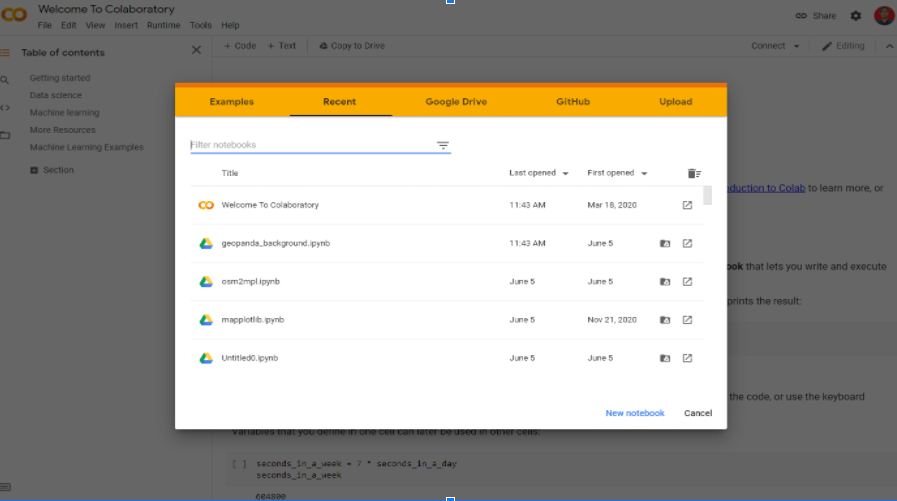

# Memperkenalkan Google Colab
Google Colaboratory atau yang biasa disebut Colab merupakan layanan komputasi awan milik Google yang mampu digunakan untuk menulis dan mengeksekusi perintah dengan bahasa Python pada browser yang digunakan. Keunggulan dari layanan ini adalah:

1. Tidak perlu melakukan konfigurasi untuk mempersiapkan environment yang akan digunakan pada project anda.

2. Memiliki akses untuk menggunakan hardware milik Google. Teknologi coud computing memungkinkan anda untuk mengeksekusi perintah dengan hardware dari penyedia layanan, dalam hal ini Google memberikan pilihan untuk menggunakan GPU ataupun tanpa GPU pada layanannya.

3. Memiliki akses untuk sharing notebook dengan orang lain, sehingga dapat mengerjakan project secara bersama-sama dan membagikannya kepada orang lain untuk digunakan secara langsung.

Oke langsung saja kita coba akses melalui link [https://colab.research.google.com](https://colab.research.google.com)

